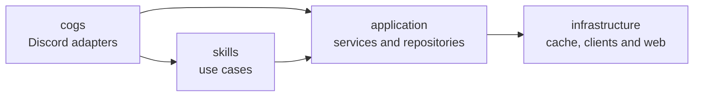

# Skill Layer Refactor

## Background

この Bot は当初、Discord の Cog がそのままゲームサーバー管理 API やシステムコマンドを呼び出す構成でした。
この構成は小規模では扱いやすい一方で、以下の問題がありました。

* Discord コマンド実装と業務ロジックが同じ場所に混在しやすい
* 同じ機能を slash/prefix コマンドと自然言語の両方から呼びたい場合に再利用しづらい
* サーバー一覧や alias 解決のような外部 API 由来の補助ロジックが Cog に漏れやすい

このため、Discord 依存の入出力層と、自然言語やコマンドのどちらからでも呼べるユースケース層を分離するために、skill layer を導入しました。

## Decision

現在の構成では、責務を以下のように分離しています。

* `cogs/`: Discord 固有のアダプタ層
* `skills/`: Bot のユースケースを表すスキル層
* `application/services/`: ユースケースから再利用されるアプリケーションサービス層
* `application/repositories/`: ユースケースが利用するデータ操作手続きを定義する層
* `infrastructure/`: 外部 API クライアントや Web エンドポイントを持つインフラ層

### Directory map

```text
.
|-- cogs/
|-- skills/
|-- application/
|   |-- repositories/
|   `-- services/
`-- infrastructure/
  |-- cache/
  |-- clients/
  `-- web/
```

### Dependency direction



依存の基本ルールは次の通りです。

* `cogs/` は Discord の入出力に責務を限定し、業務ルールは持ち込まない
* `skills/` はユースケースを表し、Discord 実装詳細には依存しない
* `application/services/` は返信調停や AI 呼び出しのような横断処理をまとめる
* `application/repositories/` はデータ操作の入口を統一し、ユースケースからの手続きを隠蔽する
* `infrastructure/` は外部 API、HTTP サーバー、将来的な永続化など、外界との接続を担当する

### Current responsibilities

* `cogs/game.py`
  Discord コマンドを受け取り、`GameServerSkill` を呼び出して結果を返信する
* `cogs/system.py`
  Discord コマンドを受け取り、`SystemSkill` を呼び出して結果を返信する
* `cogs/chat.py`
  自然言語メッセージを受け取り、先に `SkillDispatcher` で運用系スキルを試し、未処理なら通常の会話 AI にフォールバックする
* `skills/game_server_skill.py`
  ゲームサーバー状態確認、起動、停止、一覧表示のユースケースを担当する
* `skills/system_skill.py`
  システム負荷確認や ping のようなシステム系ユースケースを担当する
* `skills/dispatcher.py`
  自然言語入力に対して、どのスキルが処理を試みるかを定義する
* `application/services/ai_response_service.py`
  AI 応答生成と Discord 返信の調停を担当する
* `application/repositories/game_server_catalog_repository.py`
  ゲームサーバーカタログ操作のファサードを担当する
* `infrastructure/cache/game_server_catalog_cache_client.py`
  ゲームサーバーカタログのキャッシュ実体を保持する
* `infrastructure/clients/game_server_api.py`
  ゲームサーバー管理 API クライアント
* `infrastructure/clients/ollama_chat_client.py`
  Ollama API クライアント
* `infrastructure/web/web_endpoint_server.py`
  外部通知を受ける Web エンドポイント

## Server resolution policy

ゲームサーバーの特定は、以下の 2 段階で行います。

1. 生の自然文に対して、`name` と `server_aliases` の直接照合を行う
2. 直接照合で決まらなかった場合だけ、stopword を除去して得た候補文字列で類似度比較を行う

この順序にした理由は、日本語 alias を先にそのまま解決できるようにし、stopword 除去の副作用に依存しすぎないようにするためです。

## Contributor rules

今後の拡張では、以下のルールを守ることを推奨します。

* 新しい業務ロジックは、まず `skills/` に追加する
* `cogs/` は Discord への入出力アダプタとして保ち、外部 API 解釈や分岐ロジックを増やしすぎない
* 再利用される返信調停やアプリケーションフローは `application/services/` に置く
* データ取得・キャッシュ更新の窓口は `application/repositories/` に置く
* 外部 API クライアントや HTTP サーバーは `infrastructure/` に置く
* キャッシュや DB などの保存実体は `infrastructure/` 側に閉じ込める
* 外部 API 由来の一覧、キャッシュ、補助解決ロジックは、可能な限り Skill 本体から分離する
* 自然言語入力の解釈は、まず外部 API が持つ正式な `name` / `server_aliases` を優先して利用する

## Review checklist

設計を崩さないために、レビューでは次を確認してください。

* 新しい Discord コマンドが業務ロジックを Cog に直接持ち込んでいないか
* 新しい外部 API 呼び出しが `infrastructure/` に分離されているか
* 自然言語の判定や解決ロジックが `skills/` に集約されているか
* 返信の共通制御や AI 呼び出しが `application/services/` 側に寄せられているか

## How to extend

新しい運用系機能を追加したい場合の基本手順は以下です。

1. `skills/` に新しい skill か既存 skill のユースケースを追加する
2. 必要なら外部 API クライアントや catalog を追加する
3. Discord コマンドとして公開したい場合だけ `cogs/` に薄いアダプタを追加する
4. 自然言語でも扱いたい場合は `SkillDispatcher` に登録する

## Example change

たとえば「ゲームサーバー再起動」を追加したい場合は、以下のように考えます。

### Goal

* Discord コマンド `/gs_restart valheim-server` で再起動できる
* 自然言語の「valheim サーバー再起動して」でも同じ処理を呼べる

### Step 1: infrastructure に API クライアントを追加する

まず、ゲーム管理 API に `/restart/{server_name}` があるなら、`infrastructure/clients/game_server_api.py` にクライアントメソッドを追加します。

```python
async def restart_server(self, server_name: str):
  async with aiohttp.ClientSession() as session:
    async with session.post(f"{self.base_url}/restart/{server_name}") as resp:
      data = await resp.json()
      return {"success": resp.status == 200, "status": resp.status, "data": data}
```

### Step 2: skill にユースケースを追加する

次に、`skills/game_server_skill.py` に再起動用のキーワードとユースケースを追加します。

```python
RESTART_KEYWORDS = ("再起動", "restart", "再起")
```

`_detect_action()` で `restart` を返せるようにし、`restart_server_result()` を追加します。

```python
if any(keyword in normalized for keyword in RESTART_KEYWORDS):
  return "restart"
```

```python
async def restart_server_result(self, query_text: str | None) -> SkillExecutionResult:
  return await self._execute_action_result("再起動", query_text)
```

そのうえで `_execute_action_result()` 側で、`action_name == "再起動"` のとき `self.api.restart_server(server_name)` を呼ぶ分岐を足します。

### Step 3: Cog に薄いアダプタを足す

Discord コマンドとして公開するなら、`cogs/game.py` に薄いメソッドを追加します。

```python
@commands.hybrid_command(name="gs_restart", description="指定したサーバーを再起動します。")
async def restart_server(self, ctx, server_name: str = None):
  async with ctx.typing():
    result = await self.skill.restart_server_result(server_name)
    await self._deliver_skill_result(ctx, result)
```

ここでは業務ロジックを増やさず、skill 呼び出しだけに留めます。

### Step 4: 自然言語ルートは skill 側で自動的に有効になる

今回の構成では、自然言語の判定は `GameServerSkill.try_handle()` に集約されています。
そのため `restart` を `GameServerSkill` に追加すれば、`SkillDispatcher` 側の変更なしで自然言語ルートにも乗ります。

### What not to do

以下のような実装は避けます。

* `cogs/game.py` から直接 `GameServerAPI.restart_server()` を呼ぶ
* Discord コマンド専用の分岐と自然言語専用の分岐を別々に持つ
* alias 解決やサーバー一覧キャッシュを Cog 側に持ち込む

### Review expectation

レビューでは、再起動機能が既存ルールに沿って以下を満たしているか確認します。

* 外部 API 呼び出しは `infrastructure/clients/` にあるか
* ユースケースは `skills/` にあるか
* Cog は薄いアダプタのままか
* 自然言語とコマンドが同じ skill を再利用しているか

## Example change: read-only skill

たとえば「稼働中プレイヤー数だけを簡潔に返す」機能を追加したい場合は、更新系より軽い構成になります。

### Goal

* Discord コマンド `/gs_players valheim-server` でプレイヤー数を返す
* 自然言語の「valheim のプレイヤー数教えて」でも同じ処理を呼べる

### Implementation idea

このケースでは、新しい外部 API が不要なら `GameServerSkill` の既存 `list_servers` キャッシュをそのまま使えます。

1. `skills/game_server_skill.py` に `PLAYERS_KEYWORDS` を追加する
2. `_detect_action()` で `players` のような内部アクションを返せるようにする
3. `players_result()` を追加して、既存の `_resolve_server_from_raw_query()` を使って対象サーバーを決める
4. 対象サーバーの `stats.players` を整形して `SkillExecutionResult` を返す
5. 必要なら `cogs/game.py` に `/gs_players` を薄く追加する

### Why this example matters

この例は、外部 API クライアントを増やさずに `skills/` だけを拡張できるケースです。
「すべての変更が infrastructure から始まるわけではない」ことを示しています。

## Example change: external catalog refresh endpoint

たとえばゲーム管理アプリ側でサーバー構成が更新された直後に、Bot 側のサーバー一覧キャッシュを即時更新したい場合は、Web 層と catalog 層の連携になります。

### Goal

* `POST /catalog/game-servers`
* 外部システムから更新通知を受けたら、Bot 側で `list_servers` を再取得して catalog を更新する
* Discord へは何も投稿しない

### Implementation idea

このケースでは `infrastructure/web/` と catalog repository が変更の中心です。

1. `infrastructure/web/web_endpoint_server.py` の `_register_routes()` に新しい route を追加する
2. 認証と JSON 読み取りは既存の `_handle_tell()` と同じ補助処理を再利用する
3. Web ハンドラから、ゲームサーバー catalog repository の `fetch_latest()` を呼び出す
4. 正常終了なら HTTP 200 と更新結果だけ返し、Discord 通知は行わない

実装イメージは以下です。

```python
app.router.add_post("/catalog/game-servers", self._handle_refresh_game_server_catalog)
app.router.add_get("/catalog/game-servers", self._handle_get_game_server_catalog)
```

```python
async def _handle_refresh_game_server_catalog(self, request):
  auth_error = self._authorize(request)
  if auth_error is not None:
    return auth_error

  result = await self.bot.game_server_catalog_repository.fetch_latest()
  status_code = 200 if result.get("success") else 500
  return web.json_response(result, status=status_code)
```

```python
async def _handle_get_game_server_catalog(self, request):
  auth_error = self._authorize(request)
  if auth_error is not None:
    return auth_error

  result = await self.bot.game_server_catalog_repository.get_cached()
  status_code = 200 if result.get("success") else result.get("status", 500)
  return web.json_response(result, status=status_code)
```

### What this implies architecturally

この例を成立させるには、catalog を `GameServerSkill` の内部だけに閉じ込めず、Bot 全体から参照できる repository として配置する必要があります。

現在の実装では、Bot 起動時に `GameServerCatalogRepository` を生成して保持し、skill と Web endpoint の両方から共有する形を採用しています。

### What not to do

* catalog 更新通知のたびに Discord へ投稿する前提にしない
* Web ハンドラの中でゲームサーバー解決ロジックや自然言語ロジックまで持たない
* Web エンドポイントから直接 `GameServerSkill` を経由して副作用を起こす形にしない

### Why this example matters

この例は、「外部エンドポイントの追加」が必ずしもチャット通知ではなく、内部キャッシュや参照データの整合維持にも使えることを示しています。
また、catalog の配置やライフサイクルをどこに置くべきかを考えるきっかけになります。

## Non-goals

この refactor の目的は、Bot 全体を厳密な layered architecture に置き換えることではありません。
まずは、Discord 依存の層からユースケース層を分離し、今後の自然言語スキル追加とレビュー容易性を高めることを優先しています。